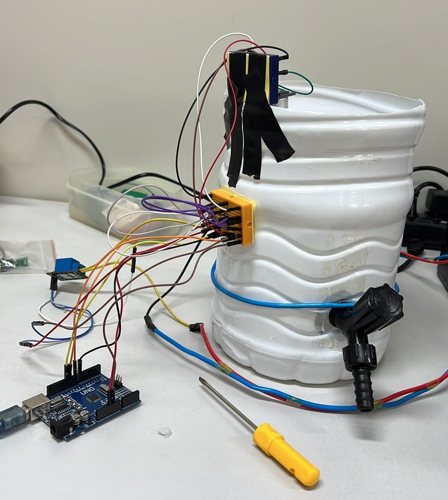

<h1 style="margin-bottom: 20px;">Protótipo para automação do controle de nível em tanques</h1>

    

<h2>Objetivo:</h2>

O trabalho refere-se a um sistema de controle de nível de um reservatório. O sistema simulado no projeta  checa e monitora o abastecimento de um tanque de 5 litros evitando o transbordamento e garantindo assim o uso eficiente e econômico da água.

<h2>Materiais usados:</h2>
<ul>
    <li>Arduino UNO</li>
    <li>Sensor ultrassônico</li>
    <li>Módulo Relé (5V)</li>
    <li>Válvula Solenóide (220v)</li>
    <li>Botão, Jumpers, Resistores, Protoboard, Tanque de
        5L, Fios, Plugs, Torneira</li>
</ul>

<h2>Vídeo de demonstração -> "Clique na imagem"</h2>

    

